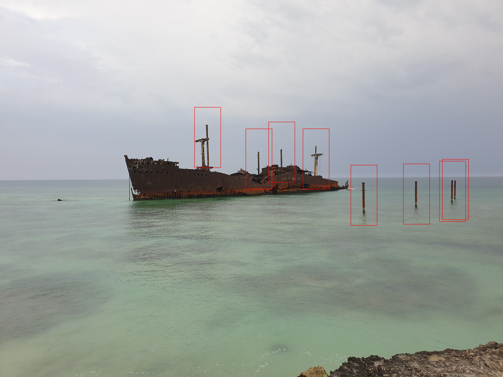
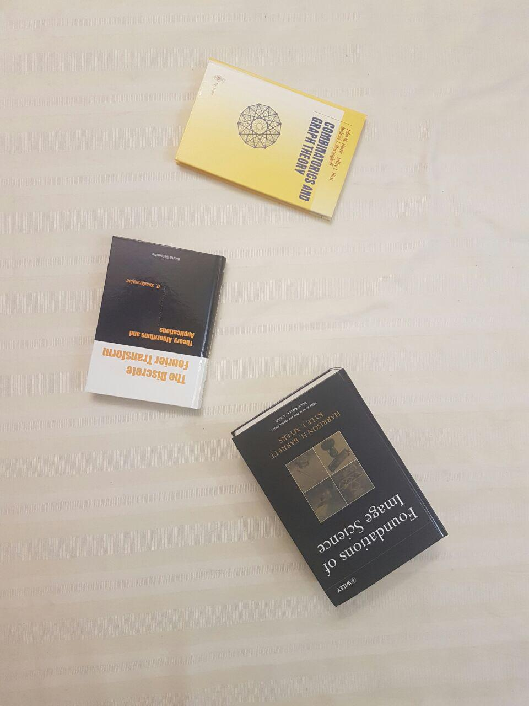
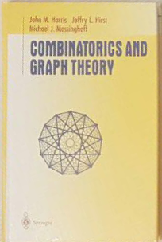
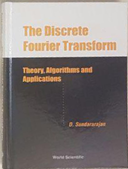
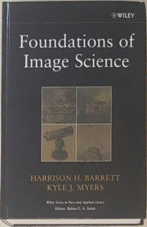
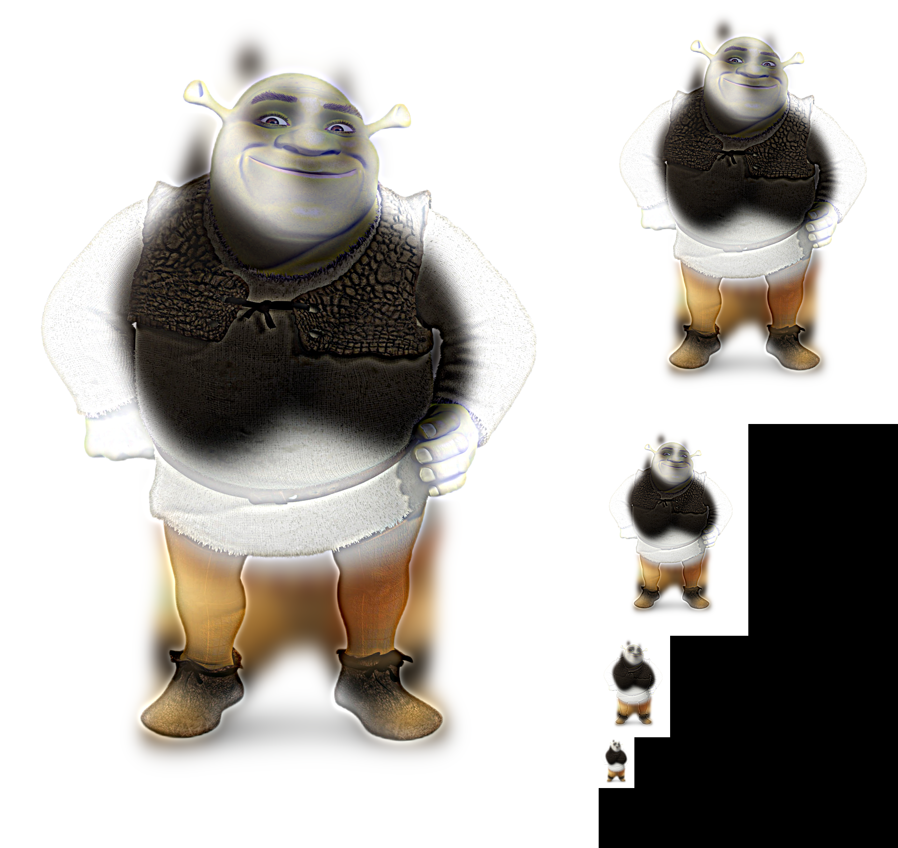

You can find the problem set pdf file in 'resources' folder.
You find All results in 'Result' folder.

This problem set contains 4 Questions. The python code for all of them can be found above. Be sure you have installed all the dependencies beforehand.

##Q2 : Template Matching
The code can be found in TemplateMatching.py. The details are provided in Persian in hw2.pdf file. You can see the final result :

## Q3: Image Warping
 The code can be found in ImageWarping.py. The details are provided in Persian in hw2.pdf file. You can see the input :

And the Final Results: 

.          |      .      |  .
:-------------------------:|:-------------------------:|:-------------------------:
 |   |  

## Q4: Hybrid Images
The code can be found in HybridImages.py. The details are provided in Persian in hw2.pdf file. You can see the final result :
