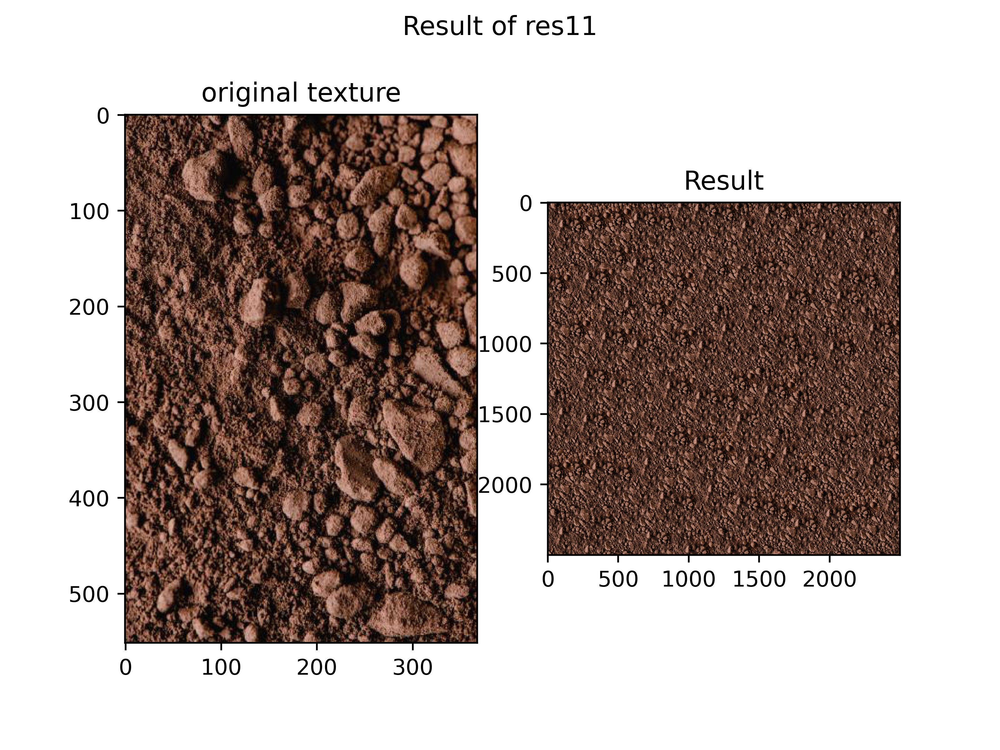
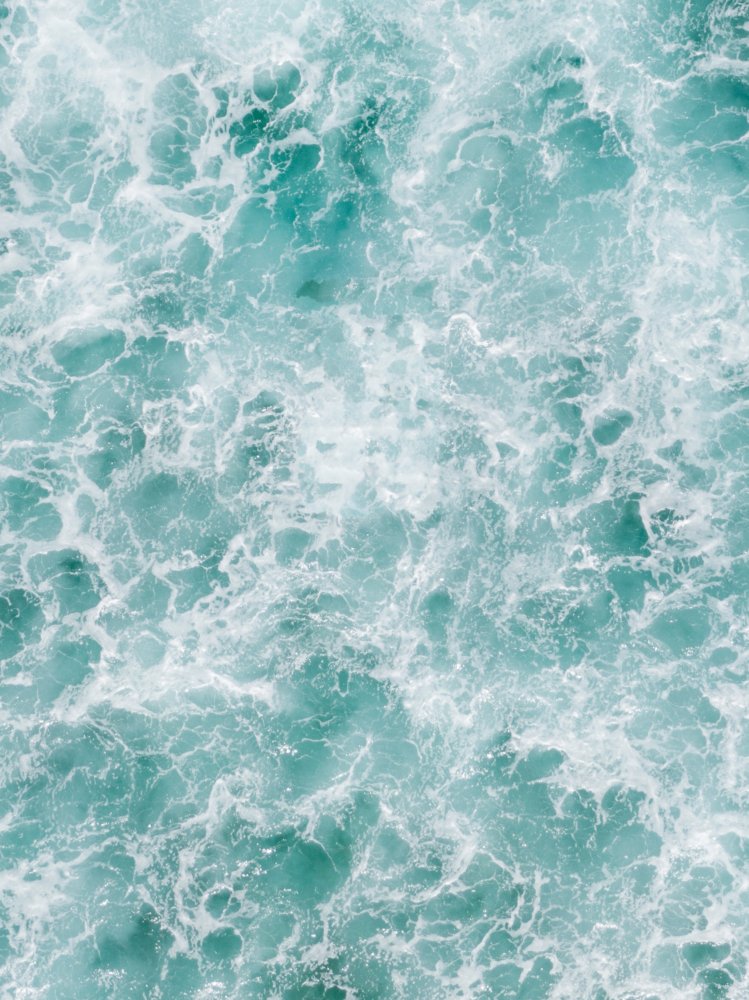
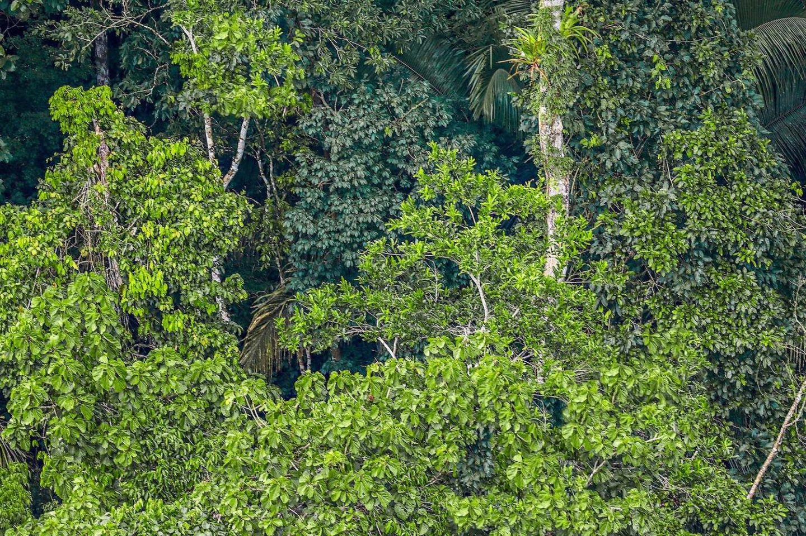

You can find the problem set pdf file in 'resources' folder.
You find All results in 'Result' folder.

This problem set contains 3 Questions. The python code for all of them can be found above. Be sure you have installed all the dependencies beforehand.

##Q2 : Texture Synthesis
The code can be found in TextureSynthesis.py. The details are provided in Persian in hw3.pdf file. You can see the final result :

## Q3: Image Inpainting
 The code can be found in ImageInpainting.py. The details are provided in Persian in hw2.pdf file. You can see the input :

And the Final Results: 

Original Image         |      Final Result    
:-------------------------:|:-------------------------:
 |   

Original Image         |      Final Result    
:-------------------------:|:-------------------------:
 |   

