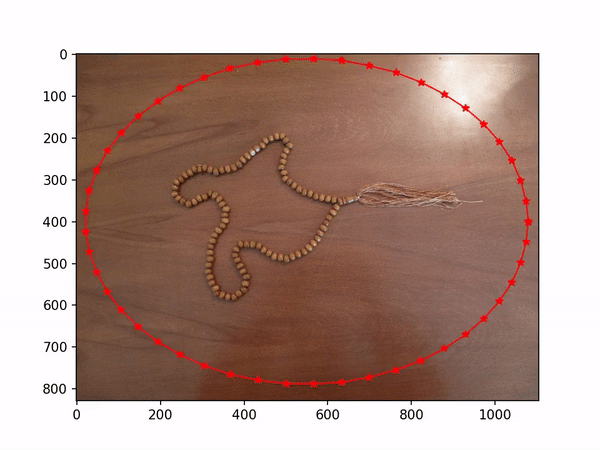

You can find the problem set pdf file in 'resources' folder.
You find All results in 'Result' folder.

This problem set contains 5 Questions. The python code for all of them(except Q4) can be found above. Be sure you have installed all the dependencies beforehand.

## Q5: Active Contour
 The code can be found in ActiveContour.py. The details are provided in Persian in hw4.pdf file. You can see the input :
And the Final Results: 

