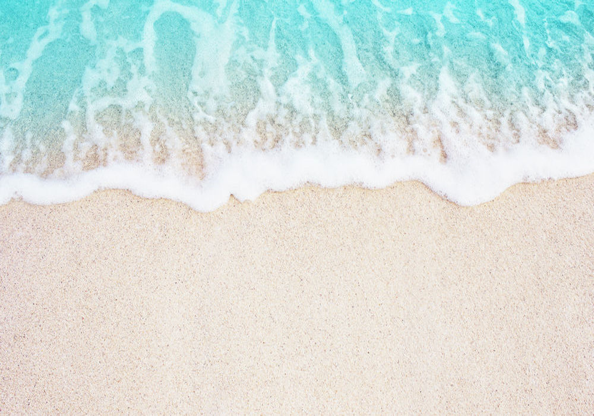

You can find the problem set pdf file in 'resources' folder.
You find All results in 'Result' folder.

This problem set contains 3 Questions. The python code for all of them(except Q4) can be found above. Be sure you have installed all the dependencies beforehand.

## Q2: Poisson Blending
 The code can be found in PoissonBlending.py. The details are provided in Persian in hw4.pdf file. You can see the input :
And the Final Results: 

Original Image 1        |      Original Image 2      |  Final Result
:-------------------------:|:-------------------------:|:-------------------------:
 |   |  
